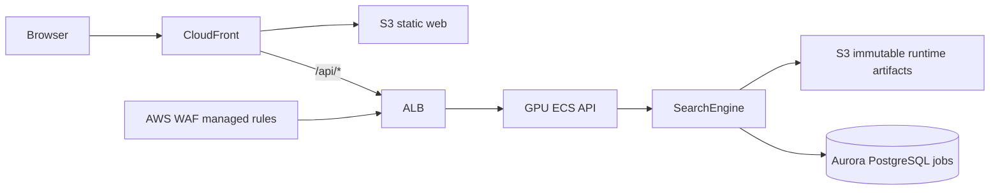

# 1111 Work Retrieval

1111 職缺搜尋平台的 production scaffold。此 repository 已包含可審查的完整原始碼、API
contract、Web UI、PostgreSQL schema、AWS CDK infrastructure 與資料匯入工具；production
retrieval engine、模型、索引與應用服務尚未交付。

**Repository:** [github.com/TakalaWang/1111-work-retrieval](https://github.com/TakalaWang/1111-work-retrieval)

## 目前狀態

| 交付項目                  | 狀態       | 依據                                                                                                                |
| ------------------------- | ---------- | ------------------------------------------------------------------------------------------------------------------- |
| 完整原始碼與測試          | 已提供     | [`apps`](apps)、[`packages`](packages)、[`infra`](infra)、[`tests`](tests)                                          |
| Python / Node 依賴鎖定    | 已提供     | [`uv.lock`](uv.lock)、[`pnpm-lock.yaml`](pnpm-lock.yaml)                                                            |
| API 與前端 contract       | 已提供     | [`openapi.json`](packages/contract/openapi.json)、[`types.d.ts`](packages/contract/types.d.ts)                      |
| 完整職缺資料快照          | 已匯入     | Aurora PostgreSQL，1,218,635 筆                                                                                     |
| Data plane                | 已部署     | `WorkRetrievalData`，AWS `us-west-2`                                                                                |
| Production `SearchEngine` | 未提供     | repository 目前只有明確的 [`SearchEngine` protocol](packages/search-core/src/work_retrieval_core/engine.py)         |
| 模型與索引                | 未發布     | 只有 [`runtime manifest schema`](packages/contract/runtime-manifest.schema.json)，沒有 runtime manifest 或 artifact |
| Retrieval benchmark       | 尚不可重現 | 缺少 engine、evaluation set、模型與索引；詳見 [`docs/benchmark.md`](docs/benchmark.md)                              |
| Application plane / API   | 未部署     | GPU capacity 預設為 `0`，且沒有 production image                                                                    |

> CI、測試與 CDK synth 只證明 repository acceptance，不等於 retrieval benchmark，也不等於已部署。

## 快速導覽

| 文件／路徑                                                                   | 用途                                                       |
| ---------------------------------------------------------------------------- | ---------------------------------------------------------- |
| [`docs/architecture.md`](docs/architecture.md)                               | 系統架構、module 邊界、runtime 與資料匯入流程              |
| [`docs/benchmark.md`](docs/benchmark.md)                                     | 可重現範圍、benchmark 缺口與未來結果證據格式               |
| [`CONTRIBUTING.md`](CONTRIBUTING.md)                                         | 開發規則、schema 變更與 PR 檢查                            |
| [`.kiro/specs/job-search-api-platform`](.kiro/specs/job-search-api-platform) | 平台 requirements、design 與待辦狀態                       |
| [`scripts/import_jobs_to_aws.py`](scripts/import_jobs_to_aws.py)             | 固定帳號、區域、checksum 與筆數的 fail-closed AWS importer |

## 環境設定

需求：

- Python `3.12.x` 與 [uv](https://docs.astral.sh/uv/)
- Node.js `24.x` 與 pnpm `10.28.0`
- PostgreSQL `16`（migration 驗證需要）

```bash
git clone https://github.com/TakalaWang/1111-work-retrieval.git
cd 1111-work-retrieval

uv sync --frozen --all-packages
pnpm install --frozen-lockfile

cp .env.example .env
set -a
source .env
set +a
```

`.env.example` 只包含本機 PostgreSQL URL，不含 AWS credential 或 production secret。

## 執行範例

### Web UI

```bash
pnpm --dir apps/web dev
```

Vite 預設提供 `http://localhost:5173`。UI 可單獨檢視，但搜尋會呼叫相對路徑
`/api/v1/jobs/search`；在 production API 尚未部署前不會得到真實結果。

### API contract

驗證 committed OpenAPI 是否與 FastAPI schema 一致：

```bash
uv run python -m work_retrieval_api.export_openapi packages/contract/openapi.json --check
pnpm --dir packages/contract generate:check
```

production engine 與 API 部署完成後，搜尋 request contract 為：

```bash
curl -fsS https://<deployment-host>/api/v1/jobs/search \
  -H 'content-type: application/json' \
  --data '{"query":"後端工程師","location_code":["1001001001"]}'
```

目前不可用假的 engine 或 fallback 把這個 request 描述成 production 搜尋結果。

### PostgreSQL migration

先建立 `work_retrieval` database，再執行：

```bash
uv run alembic -c database/alembic.ini upgrade head
uv run alembic -c database/alembic.ini upgrade head
uv run alembic -c database/alembic.ini check
```

第二次 upgrade 驗證 migration 可重複執行；`alembic check` 驗證 SQLAlchemy metadata 沒有未提交的
schema drift。

## Benchmark 重現

目前沒有可誠實重現的 retrieval benchmark：repository 尚未包含 production `SearchEngine`、固定的
evaluation queries/qrels、模型 artifact 或索引 artifact。因此也沒有官方 benchmark command 或可發布的
Recall、MRR、nDCG、latency 數字。

現階段可以重現的是 repository acceptance suite：

```bash
git rev-parse HEAD

uv sync --frozen --all-packages
uv run ruff check .
uv run ruff format --check .
uv run mypy
uv run pytest
uv run python -m work_retrieval_api.export_openapi packages/contract/openapi.json --check

pnpm install --frozen-lockfile
pnpm format:check
pnpm lint
pnpm --dir packages/contract generate:check
pnpm --dir apps/web check
pnpm --dir apps/web test
pnpm --dir apps/web build
pnpm --dir infra test
pnpm --dir infra build
pnpm --dir infra synth
```

完整的重現邊界、需要固定的 inputs 與未來 benchmark result 格式見
[`docs/benchmark.md`](docs/benchmark.md)。在那些 artifact 交付前，本 repository **不宣稱**已滿足
retrieval benchmark 重現要求。

## 資料、模型與索引版本

| 類型                      | 目前版本／識別方式                                                                                              | 狀態                                 |
| ------------------------- | --------------------------------------------------------------------------------------------------------------- | ------------------------------------ |
| Source code               | `git rev-parse HEAD`                                                                                            | 以 commit SHA 固定                   |
| Python dependencies       | [`uv.lock`](uv.lock)                                                                                            | 鎖定                                 |
| Node dependencies         | [`pnpm-lock.yaml`](pnpm-lock.yaml)；pnpm `10.28.0`                                                              | 鎖定                                 |
| API contract              | [`packages/contract/openapi.json`](packages/contract/openapi.json)                                              | committed、CI 檢查 drift             |
| Database schema           | Alembic `0002_create_jobs`；PostgreSQL 16                                                                       | 已匯入環境為 Aurora PostgreSQL 16.13 |
| Job dataset               | SHA-256 `53937f7bf076789c4cd7e3be34fb89875336108d57707b5a93182181e1087089`；1,218,635 rows；1,285,945,103 bytes | 已驗證並匯入                         |
| Runtime manifest format   | schema version `1`                                                                                              | schema 已提交，manifest 未發布       |
| Retrieval model           | 無                                                                                                              | 未發布                               |
| Search index / embeddings | 無                                                                                                              | 未發布                               |

資料物件使用 content-addressed key：

```text
s3://workretrievaldata-runtimebucket404c5ee4-hkvrjx5fbkij/data/jobs/53937f7bf076789c4cd7e3be34fb89875336108d57707b5a93182181e1087089/jobs.csv
```

2026-08-01 的 AWS readback 驗證 1,218,635 rows、1,218,635 distinct job IDs、
`source_row` 範圍 `0..1218634`、Alembic revision `0002_create_jobs`，以及 public schema 只有
`alembic_version` 與 `jobs`。

## 架構摘要



這是 application plane 的目標架構；目前只部署 persistent data plane。完整的責任邊界、啟動流程、
資料匯入與 deployment flow 見 [`docs/architecture.md`](docs/architecture.md)。

## 部署邊界

`WorkRetrievalData` 已在 competition account `378849533305`、`us-west-2` 部署，包含共享 VPC、
private/versioned S3 bucket 與 Aurora PostgreSQL 16.13 Serverless v2。它不包含 ALB、CloudFront、
WAF、ECR、ECS 或 GPU capacity。

完整平台只能透過 manual `workflow_dispatch` 部署，且需要 protected `production` environment、
`DEPLOY_ENABLED=true`、精確確認字串、immutable API image digest 與 runtime manifest SHA-256。
push 到 `main` 不會自動部署。

## 參與開發

請先閱讀 [`CONTRIBUTING.md`](CONTRIBUTING.md)。API schema 變更必須一併提交 OpenAPI 與生成的
TypeScript types；database schema 變更必須新增 forward-only Alembic revision。
