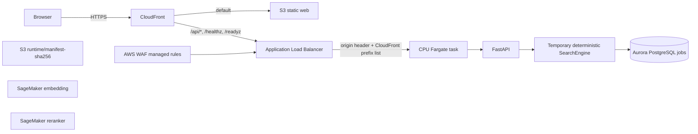
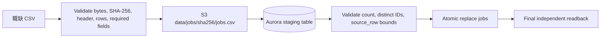
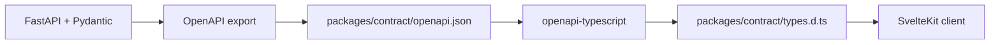

# System Architecture and Data Flow

本文件描述 repository 現有的程式責任邊界與已部署 production flow。它不把暫時的 deterministic
search engine 描述為正式 retrieval implementation。

## Delivery status

| Plane                    | 現況                                                                                                       |
| ------------------------ | ---------------------------------------------------------------------------------------------------------- |
| Data plane               | `WorkRetrievalData` 已部署；Aurora 與完整職缺快照已完成 readback                                           |
| Application plane        | `WorkRetrievalPlatform` 已部署；CloudFront、Web、ALB 與 CPU Fargate API 已通過 public smoke                |
| Model plane              | Embedding 與 reranker SageMaker endpoints 均為 `InService`，runtime artifacts 已提升到 immutable S3 prefix |
| Retrieval implementation | API 暫時固定回傳 Aurora 前十個 job ID；正式 normalization、ranking 與 model integration 尚未提供           |

## Source modules

| Module                          | 唯一責任                                                               | 不負責                                   |
| ------------------------------- | ---------------------------------------------------------------------- | ---------------------------------------- |
| `apps/api`                      | HTTP validation、error envelope、lifecycle、request ID、OpenAPI        | ranking、database model、fallback engine |
| `apps/web`                      | 呼叫相對 API path、顯示狀態、驗證不可信 response JSON                  | ranking 或 server-side data access       |
| `packages/search-core`          | immutable query type 與 `SearchEngine` protocol                        | 具體 retrieval algorithm                 |
| `packages/database`             | authoritative SQLAlchemy `Job` model 與 PostgreSQL read repository     | HTTP schema                              |
| `packages/contract`             | committed OpenAPI、generated TypeScript types、runtime manifest schema | runtime artifacts                        |
| `database`                      | forward-only Alembic migration history                                 | application query logic                  |
| `infra`                         | `WorkRetrievalData` 與 `WorkRetrievalPlatform` CDK stacks              | production image 或模型內容              |
| `scripts/import_jobs_to_aws.py` | 固定資料快照的驗證、上傳、atomic import 與 readback                    | 一般用途 ETL                             |

這些邊界讓 HTTP、retrieval、persistence 與 deployment 可以獨立演進；沒有共享一個「萬用 model」，也
沒有在缺少 production implementation 時靜默改走 mock 或 fallback。

## Deployed request flow

GPU ECS capacity provider 與 service 已建立，但 capacity 與 desired count 維持 `0`；public traffic 只進入
CPU Fargate service。S3 artifacts、embedding 與 reranker 已可用，但暫時 engine 尚未呼叫它們。正式
`SearchEngine` 必須顯式整合 normalization、retrieval、reranking 與 lineage，不得靜默 fallback。

### API lifecycle

1. Application startup 初始化 PostgreSQL repository 與暫時 engine；任一失敗就中止，不選替代 engine。
2. FastAPI 在 trust boundary 驗證 body 大小、media type、query 與 filters。
3. Async route 透過 worker thread 呼叫同步 `SearchEngine.search(query, limit=10)`。
4. API 再驗證結果最多十筆、job ID 為 ASCII decimal、沒有重複且 rank 連續。
5. Browser 對 response JSON 執行相同的不可信邊界驗證。
6. Shutdown 只關閉該 engine 一次。

`/healthz` 代表 process 存活；`/readyz` 只有 engine 成功初始化後才會 ready。Logs 記錄 request metadata
與 latency，不記錄 query text。

## Job data import flow

Importer 固定並驗證以下 inputs：

- AWS profile `competition`、account `378849533305`、region `us-west-2`
- 39-column UTF-8 CSV header
- SHA-256 `53937f7bf076789c4cd7e3be34fb89875336108d57707b5a93182181e1087089`
- 1,285,945,103 bytes 與 1,218,635 data rows
- Alembic revision `0002_create_jobs`

任何一項不一致都會停止。Importer 使用 Aurora `aws_s3` extension 匯入 staging table，驗證完成後才在
transaction 內替換 `jobs`；不提供 row-by-row Data API fallback。

## Contract flow

OpenAPI 與 TypeScript types 都提交到 Git。CI 重新生成並拒絕 drift；browser runtime validation 仍然保留，
因為 TypeScript 型別不能驗證網路輸入。

## Infrastructure ownership

| Stack                   | Owns                                                                                                                |
| ----------------------- | ------------------------------------------------------------------------------------------------------------------- |
| `WorkRetrievalData`     | VPC、S3 gateway endpoint、private/versioned runtime bucket、database security group、Aurora、Secrets Manager secret |
| `WorkRetrievalPlatform` | ECR、GPU ECS、interface endpoints、ALB、CloudFront、WAF、static web bucket、logs、GitHub OIDC deploy role           |

Data stack 可以單獨存在且沒有 application fixed cost。Platform stack reuse 同一個 VPC、bucket、cluster 與
database security group，不會建立第二份資料來源。

## Trust and failure boundaries

- API 與 browser 都 fail closed；malformed engine output 或 response 不會降級成部分結果。
- Runtime assets 必須由 manifest SHA-256 與每個 artifact SHA-256 固定，不使用 mutable `latest`。
- PostgreSQL 是唯一 relational database；不提供 SQLite compatibility path。
- ALB 只接受 CloudFront origin-facing prefix list，並驗證 generated origin header。
- Deployment 使用 GitHub OIDC 與 protected environment，不保存 long-lived AWS credentials。
- GPU desired capacity 預設 `0`；只有 image digest 與 runtime manifest 都批准後才能啟用。
