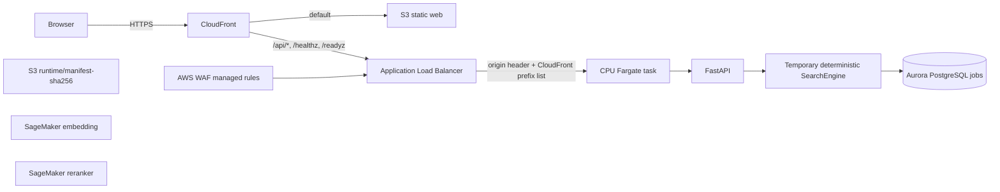
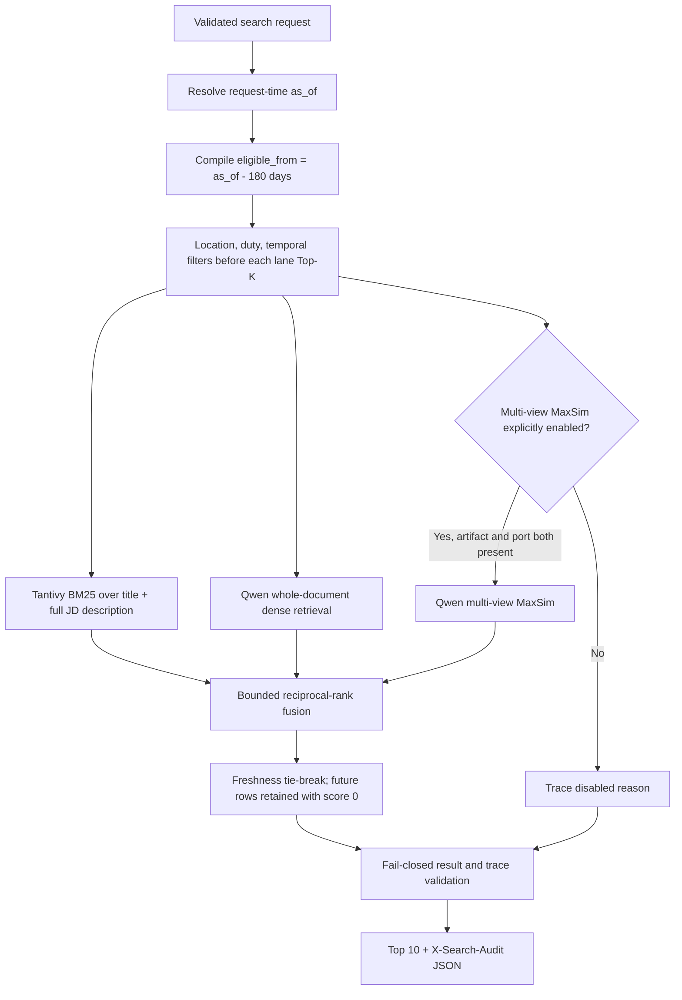
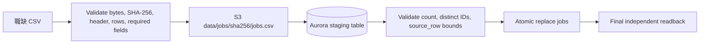
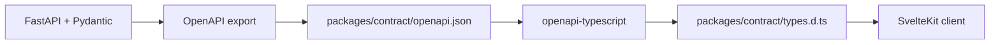

# System Architecture and Data Flow

本文件分開描述 repository 的 search-core v2 source contract 與目前已部署 production flow；source
完成不代表 image、GitOps rollout 或 live traffic 已更新。

## Delivery status

| Plane                    | 現況                                                                                                       |
| ------------------------ | ---------------------------------------------------------------------------------------------------------- |
| Data plane               | `WorkRetrievalData` 已部署；Aurora 與完整職缺快照已完成 readback                                           |
| Application plane        | `WorkRetrievalPlatform` 已部署；CloudFront、Web、ALB 與 CPU Fargate API 已通過 public smoke                |
| Model plane              | Embedding 與 reranker SageMaker endpoints 均為 `InService`，runtime artifacts 已提升到 immutable S3 prefix |
| Retrieval implementation | source 已提供 manifest-driven search-core v2；目前已部署 API 仍是舊 deterministic runtime，尚未 rollout 新 adapters |

## Source modules

| Module                          | 唯一責任                                                               | 不負責                                   |
| ------------------------------- | ---------------------------------------------------------------------- | ---------------------------------------- |
| `apps/api`                      | HTTP validation、runtime wiring、lifecycle、request ID、OpenAPI、audit header | ranking、database model、fallback engine |
| `apps/web`                      | 呼叫相對 API path、顯示狀態、驗證不可信 response JSON                  | ranking 或 server-side data access       |
| `packages/search-core`          | temporal eligibility、candidate ports、RRF fusion、freshness 與 audit trace | HTTP、artifact 下載、adapter 實作         |
| `packages/database`             | authoritative SQLAlchemy `Job` model 與 PostgreSQL read repository     | HTTP schema                              |
| `packages/contract`             | committed OpenAPI、generated TypeScript types、runtime manifest schema | runtime artifacts                        |
| `database`                      | forward-only Alembic migration history                                 | application query logic                  |
| `infra`                         | `WorkRetrievalData` 與 `WorkRetrievalPlatform` CDK stacks              | production image 或模型內容              |
| `scripts/import_jobs_to_aws.py` | 固定資料快照的驗證、上傳、atomic import 與 readback                    | 一般用途 ETL                             |

這些邊界讓 HTTP、retrieval、persistence 與 deployment 可以獨立演進；沒有共享一個「萬用 model」，也
沒有在缺少 production implementation 時靜默改走 mock 或 fallback。

## Deployed request flow

GPU ECS capacity provider 與 service 已建立，但 capacity 與 desired count 維持 `0`；public traffic 只進入
CPU Fargate service。S3 artifacts、embedding 與 reranker 已可用，但暫時 engine 尚未呼叫它們。正式
`SearchEngine` 必須顯式整合 normalization、retrieval、reranking 與 lineage，不得靜默 fallback。

## Search-core v2 source flow

`as_of` 每次 request 才解析；production 未設定 override 時使用當下 UTC。Competition Demo 可明確設定
`SEARCH_DEMO_AS_OF=2026-06-08`，date-only 值以 `Asia/Taipei` 當日 00:00 解讀。時間 eligibility 只設定
下界，不設定上界，因此 `source_modified_at > as_of` 的資料仍可被召回，但 freshness 必須是 `0`。

每個 candidate adapter 都收到同一個 `CandidateRequest`，其中包含 `minimum_updated_at`、location 與 duty
codes，且正式 ports 明確命名為 `lexical_full_jd` 與 `dense_whole_jd`。Adapter 必須在 Top-K 前套用三種
filters；engine 在 fusion 前再拒絕任何早於時間下界的 evidence。BM25 view 必須包含 `title`、`description`
與其餘可檢索 JD 欄位，dense view 則以完整 JD 建立單一 Qwen whole-document embedding。

Lexical 與 whole-document dense 是必要 lane，request-time 平行執行；任一 lane 失敗就回傳 503，不會只用
另一 lane 產生看似成功的結果。融合只使用 bounded RRF，freshness 只在相同融合分數時決定順序，不覆蓋
query relevance。

Multi-view MaxSim 必須同時滿足明確 environment feature flag、immutable manifest artifact entry 與 runtime
port 三個條件；缺少任一項會在 startup fail closed。Graph、reranker、LTR 與 guardrail 尚未取得可發布
calibration，正式 source 沒有啟用入口，實際 disabled reason 會保留在每次 audit trace。

Runtime 啟動需要：

- `SEARCH_RUNTIME_MANIFEST_PATH`：local immutable manifest path，沿用 committed schema version `1`。
- `SEARCH_PORT_FACTORY=module:callable`：建立 Tantivy/Qwen ports 的 deployment-owned factory。
- `SEARCH_ENABLE_MULTIVIEW_MAXSIM=true|false`：唯一的 MaxSim 開關，預設 `false`。
- `SEARCH_MULTIVIEW_ARTIFACT_KEY`：只在 MaxSim 開啟時必填，且必須存在於 manifest。
- `SEARCH_DEMO_AS_OF`：只供固定 Demo / fixture 使用；production 應省略。

Repository 不攜帶 1.2M 職缺、embedding 或 model。Adapter 與 artifacts 由 deployment 提供；環境缺少
manifest/factory、manifest 含未知欄位、artifact 不一致或 port output 違約，都會停止服務而非 fallback。
API JSON body 維持既有 `request_id + result` contract，逐職缺的 lane rank、RRF contribution、freshness、
source timestamp 與所有 lane 狀態放在 `X-Search-Audit` JSON header；header 超過 7 KiB 會 fail closed。

### API lifecycle

1. Application startup 驗證 runtime manifest 並由指定 factory 建立 retrieval ports；任一失敗就中止。
2. FastAPI 在 trust boundary 驗證 body 大小、media type、query 與 filters。
3. Async route 透過 worker thread 呼叫同步 `SearchEngine.search(query, limit=10)`。
4. API 驗證結果最多十筆、job ID 為 ASCII decimal、沒有重複、trace 對應相同排序且大小受限。
5. Browser 對 response JSON 執行相同的不可信邊界驗證。
6. Shutdown 只關閉該 engine 一次。

`/healthz` 代表 process 存活；`/readyz` 只有 engine 成功初始化後才會 ready。Logs 記錄 request metadata
與 latency，不記錄 query text。

## Job data import flow

Importer 固定並驗證以下 inputs：

- AWS profile `competition`、account `378849533305`、region `us-west-2`
- 39-column UTF-8 CSV header
- SHA-256 `53937f7bf076789c4cd7e3be34fb89875336108d57707b5a93182181e1087089`
- 1,285,945,103 bytes 與 1,218,635 data rows
- Alembic revision `0002_create_jobs`

任何一項不一致都會停止。Importer 使用 Aurora `aws_s3` extension 匯入 staging table，驗證完成後才在
transaction 內替換 `jobs`；不提供 row-by-row Data API fallback。

## Contract flow

OpenAPI 與 TypeScript types 都提交到 Git。CI 重新生成並拒絕 drift；browser runtime validation 仍然保留，
因為 TypeScript 型別不能驗證網路輸入。

## Infrastructure ownership

| Stack                   | Owns                                                                                                                |
| ----------------------- | ------------------------------------------------------------------------------------------------------------------- |
| `WorkRetrievalData`     | VPC、S3 gateway endpoint、private/versioned runtime bucket、database security group、Aurora、Secrets Manager secret |
| `WorkRetrievalPlatform` | ECR、GPU ECS、interface endpoints、ALB、CloudFront、WAF、static web bucket、logs、GitHub OIDC deploy role           |

Data stack 可以單獨存在且沒有 application fixed cost。Platform stack reuse 同一個 VPC、bucket、cluster 與
database security group，不會建立第二份資料來源。

## Trust and failure boundaries

- API 與 browser 都 fail closed；malformed engine output 或 response 不會降級成部分結果。
- Runtime assets 必須由 manifest SHA-256 與每個 artifact SHA-256 固定，不使用 mutable `latest`。
- PostgreSQL 是唯一 relational database；不提供 SQLite compatibility path。
- ALB 只接受 CloudFront origin-facing prefix list，並驗證 generated origin header。
- Deployment 使用 GitHub OIDC 與 protected environment，不保存 long-lived AWS credentials。
- GPU desired capacity 預設 `0`；只有 image digest 與 runtime manifest 都批准後才能啟用。
