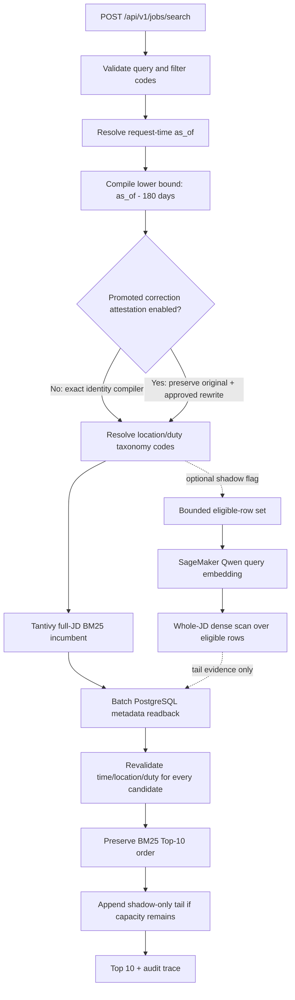

# Search-core v2 architecture

本文件描述目前 source code 的 production serving 契約。它不代表新版 image、runtime artifacts 或 public
traffic 已完成 rollout；部署狀態仍須分別以 Git SHA、ECR digest、CloudFormation、ECS target health 與
public smoke readback 證明。

## Request flow



Tantivy BM25 是唯一已升版的 production Top-10 incumbent。A0--A6 是 promotion 狀態，不是功能願望清單：

| Stage | Production 狀態    | 依據與邊界                                                                |
| ----- | ------------------ | ------------------------------------------------------------------------- |
| A0    | promoted           | contract validation、180 天 eligible universe、location/duty hard filters |
| A1    | promoted           | full-JD BM25F；exact/all-term evidence；query correction 預設關閉         |
| A2    | incumbent + shadow | sealed whole-Qwen cache 衍生 MRL1024 可用；multi-view 尚待消融            |
| A3    | off                | LTR 尚無足夠且可信的 labeled groups／IPS-DR 證據                          |
| A4    | shadow             | reranker 尚未證明 Top-10 正向提升                                         |
| A5    | off                | Graph 目前消融負向且延遲較高；保留可重現 challenger                       |
| A6    | partial            | 只啟用 180 天 hard cutoff；freshness/rank guardrail 重排關閉              |

BM25 component 預設明確關閉 query correction，
因此可在沒有 LLM/Graph artifact 的情況下獨立建置、評估與服務；只有 train-only candidate 通過 organizer
fixed-input NDCG@10 正向顯著性驗證並提供 SHA-pinned attestation 時才允許重建成 enabled component。Dense
預設關閉；顯式開啟時只提供 shadow/tail
evidence，不能改排 BM25 Top-10，失敗也不影響 incumbent。Graph、multi-view MaxSim、reranker、LTR 與
guardrail 預設關閉；Graph 只有在 `SEARCH_ENABLE_GRAPH=true` 且 manifest 含已 promotion 的 immutable
Graph component 時才改用 bounded Graph-conditioned Tantivy。該 component 必須以原始 candidate manifest
固定六個 Graph 檔，並固定 serving policy 與 implementation SHA、
外部 organizer attestation、正向 NDCG@10 report、serving algorithm 與 canonical policy SHA；offline 與
production ranking 以 golden parity test 鎖定。其他宣稱啟用但沒有 production adapter 的模組
會直接拒絕啟動。Freshness
只留在 audit 與未來 LTR shadow feature；離線 rank-decay ablation 為負向，因此不拿來重排 relevance。

## Time and hard-filter contract

- `as_of` 在每個 request 動態取得；production 不固定日期。
- Demo 可設 `SEARCH_DEMO_AS_OF=2026-06-08`，代表台灣時間
  `2026-06-08T23:59:59.999+08:00`。
- eligibility 是 `source_modified_at >= as_of - 180 days`，而且在每條 lane 的 Top-K 前套用。
- snapshot 中 `source_modified_at > as_of` 的資料保留，不設人為上界；其 freshness 固定為 `0`，並標記
  `future_updated_snapshot=true`。
- location 內為 OR、duty 內為 OR、location 與 duty 之間為 AND；未知 taxonomy code 是確定的 no-match。
- Tantivy 雖已 pre-filter，engine 仍以 PostgreSQL authoritative metadata 逐筆重驗 180 天下界、location、
  duty 與所有已編譯 typed constraints；缺資料或任一不一致都 fail closed。

這個設計避免把 freshness 當成 relevance，也避免「adapter 宣稱套用 filter、實際卻在 Top-K 後過濾」的
不可觀測錯誤。

## Text and embedding contracts

### BM25

Tantivy 0.26 index 使用固定欄位與權重：

| Field      | Contents                 | Weight |
| ---------- | ------------------------ | -----: |
| `title`    | 職務名稱                 |   15.0 |
| `duty`     | 職務大／中／小類         |    8.0 |
| `skills`   | 電腦技能、工作技能、證照 |    6.0 |
| `industry` | 產業大／中／小類         |    1.0 |
| `body`     | 職務內容與其餘需求條件   |    0.5 |

所以職務內容不是只拿去 embedding；它同時可被 lexical retrieval 找到。索引另含 raw-tokenized
`location_filter`、`duty_filter`、`visibility_filter`、unsigned `updated_at_epoch_ms` 與 fast
`job_index`。官方競賽 CSV 沒有可見性欄位，因此競賽模式把已下載的封閉 JD pool 明確視為
eligible corpus，並寫入常數 `visibility=1`；這是 corpus eligibility 假設，不是 CSV 提供的
可見性事實。真實廠商 feed 必須另外提供並在回傳前重驗當下可見性。

### Whole-JD Qwen

Production 不重算 1.2M 筆 whole embedding，而是重用已獨立驗證、不可變的
`2026-07-24-clean-v1` EVA cache。該 cache 固定序列化 15 個欄位，包含職務名稱、職務分類、技能、證照、
經驗、學歷、城市、產業分類、附加條件及完整職務內容；因此 body 並未從 dense evidence 消失。Serving
materializer 只做 deterministic projection：讀取既有 4096 維 shard、取前 1024 維、以 float32 L2
renormalize，再封存為 float16 新 shard，絕不覆寫 source cache。Artifact 必須 pin：

- model `Qwen/Qwen3-Embedding-8B`
- revision `1d8ad4ca9b3dd8059ad90a75d4983776a23d44af`
- TEI source dimension `4096`，取 MRL prefix `1024` 後獨立 L2 normalize，以 `float16` 儲存
- projection、document policy/template SHA、source manifest/inventory SHA、job row-order SHA
- 每個 derived shard SHA/size 及其對應的 source shard SHA
- query prompt
  `Instruct: Given a job search query, retrieve relevant job postings matching the user's intent\nQuery: `

Query embedding 由 AWS SageMaker endpoint 產生，response 必須是 finite `1 x 4096`，runtime 取前 1024 維
後再次 L2 normalize。啟動時會以 SageMaker control-plane readback 驗證 endpoint → endpoint config → model、
TEI image digest 與完整 model environment。Exact scan 只在顯式 shadow flag 下使用，且限制單一 in-flight、
最多 250,000 eligible rows 與 2 秒 deadline；它不是 production 預設。未來 ANN 必須以相同 filter、projection
與 row-order contract 做 recall/latency promotion。

## Immutable artifact startup

Production container 啟動順序：

1. 從 `s3://$ARTIFACT_BUCKET/runtime/$ARTIFACT_MANIFEST_SHA256/manifest.json` 下載 root manifest。
2. 驗證 root manifest 完整 bytes 的 SHA-256。
3. 解析嚴格 schema v2，拒絕 unknown keys、不完整 release、錯誤 model revision、row-order drift、未套
   pre-Top-K filter 或 `future_jobs=retained_with_zero_freshness`。
4. 計算所需空間與最低 12 GiB runtime memory；容量不足即停止。
5. 一律下載 BM25 component prefix；只在 dense shadow flag 開啟時下載 whole-embedding prefix。每一物件先寫
   `.partial`，驗證 size 與 SHA 後 atomic rename。
6. 既有檔案也重新驗證；不覆寫 corrupted local artifact，不載入 mutable/latest path。
7. Component manifest 再驗證 vector build lineage、job IDs、Tantivy files、實際 `meta.json` schema/tokenizers、
   lexical source mapping、taxonomy、sealed whole source manifest/inventory、每個 derived/source shard SHA，
   以及 query correction 的 exact disabled branch 或 candidate + positive
   promotion attestation；不允許缺件後降級。
8. 建立必要 adapters；若 dense shadow 開啟，還要先完成 SageMaker model identity readback；全部成功後
   `/readyz` 才 ready，且回傳實際載入 root manifest 的 SHA-256 供 deployment 精確比對。

必要環境設定：

```text
ARTIFACT_BUCKET
ARTIFACT_MANIFEST_SHA256
AWS_REGION
SEARCH_RUNTIME_ROOT
SEARCH_RUNTIME_MANIFEST_PATH
SEARCH_PORT_FACTORY=work_retrieval_api.production:create_production_ports
SEARCH_ENABLE_DENSE_SHADOW=false
SEARCH_ENABLE_MULTIVIEW_MAXSIM=false
DB_HOST DB_PORT DB_NAME DB_USER DB_PASSWORD
```

`SEARCH_ENABLE_DENSE_SHADOW=true` 時另必須提供 exact-pinned `EMBEDDING_ENDPOINT_NAME`、
`EMBEDDING_ENDPOINT_CONFIG_NAME` 與 `EMBEDDING_MODEL_NAME`；BM25-only 不會建立或呼叫 endpoint client。

Repository、container image 與 Git 都不包含 1.2M 職缺、9.3 GiB embeddings 或 model weights。

## Deployment topology

Source-defined production topology is CloudFront → ALB → one explicitly selected compute profile. The default
`cpu-incumbent` profile runs one 2 vCPU／16 GiB Fargate task for the promoted temporal BM25 hot path and fixes the GPU
ASG/service at `0/0/0`. The opt-in `gpu-shadow` profile fixes CPU desired count at `0`、GPU ASG min/max at `1/2` and
GPU service desired count at `1`; callers cannot compose mixed capacities. Both services are registered with the same
target group, but only the selected profile has non-zero desired capacity. GPU root volume is encrypted 100 GiB gp3
and its container memory reservation is 12 GiB. SageMaker remains an optional shadow query encoder; Dense、Graph、
LTR and reranker stay disabled in the incumbent profile, and no compute failure silently changes profiles.

Deployment workflow verifies the downloaded manifest body SHA and essential v2 policy before building the image.
Runtime performs the stronger per-object verification again. This duplicates a security boundary intentionally: CI
prevents a known-incompatible rollout, while the task protects every startup.

## Explainability and challenger promotion

The audit trace records request `as_of`, lower bound, corpus-safe query rewrites, filter verification state, lane
status, raw lane scores/ranks, incumbent contribution, freshness, source timestamp and future-snapshot flag for every
returned job. It does not expose invented skill explanations.

Graph remains a challenger because competition evidence must demonstrate causality, not merely architecture. A graph
artifact may only use train-period JDs, must pin cutoff and maximum source timestamp, and must ship traversal traces.
LLM extraction uses a deterministic duty-stratified sample (default 5,000, hard cap 10,000) rather than sending the
entire 1.2M-row corpus to a model; its manifest pins the eligible population, per-duty quotas and stable-hash sample.
Promotion requires a one-command time-split ablation in which graph-on materially improves the agreed primary metric;
otherwise graph stays off while its experiment remains reproducible.

## Failure boundaries

- No mock, history-answer, legacy-manifest or unverified ranking fallback exists. BM25-only is the promoted serving
  policy, not an error fallback.
- Candidate lanes must return unique ASCII-decimal job IDs, explicit contiguous ranks and monotonic finite scores.
- API output must be at most ten unique jobs, with trace order exactly matching the response.
- Query text is not written to access logs; only lengths/counts, request ID, status and latency are logged.
- `/healthz` is process health；`/readyz` requires a successfully initialized immutable runtime and returns its
  exact root-manifest SHA-256；deployment smoke rejects an otherwise healthy stale runtime.
- API 與 browser 都 fail closed；malformed engine output 或 response 不會降級成部分結果。
- Runtime assets 必須由 v2 manifest SHA-256 與每個 artifact SHA-256/size 固定，不使用 mutable
  `latest`；component inventory 必須恰好涵蓋 root inventory，且禁止 query history、GT/qrels、test JD、
  raw logs 與 secrets。`complete` 與 `publication_allowed` 必須同時通過；所有 data objects 通過分頁
  inventory audit 後才寫入 manifest，並對 manifest body 與完整 prefix 回讀。
- PostgreSQL 是唯一 relational database；不提供 SQLite compatibility path。
- 完整 jobs snapshot 匯入在單一 transaction 內先取得 source-pinned PostgreSQL advisory lock；並行匯入
  取不到 lock 即失敗，不共享或互相刪除 `jobs_import` staging table。
- ALB 只接受 CloudFront origin-facing prefix list，並驗證 generated origin header。
- Deployment 使用 GitHub OIDC 與 protected environment，不保存 long-lived AWS credentials。
- Compute profile 必須顯式選擇且互斥；預設 `cpu-incumbent`。只有 image digest、runtime manifest 與
  `gpu-shadow` profile 都明確批准後，GPU capacity 才能啟用。
