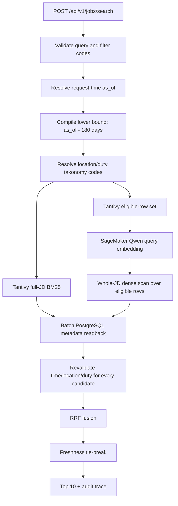

# Search-core v2 architecture

本文件描述目前 source code 的 production serving 契約。它不代表新版 image、runtime artifacts 或 public
traffic 已完成 rollout；部署狀態仍須分別以 Git SHA、ECR digest、CloudFormation、ECS target health 與
public smoke readback 證明。

## Request flow



Tantivy 與 dense 是兩條必要 lane，會平行執行；任一失敗即回傳 503，不以另一條 lane 靜默降級。Graph、
multi-view MaxSim、reranker、LTR 與 guardrail 預設關閉，audit trace 會記錄原因。尚未有正向、可重現的
promotion evidence 前，不會把 challenger 混入 production ranking。

## Time and hard-filter contract

- `as_of` 在每個 request 動態取得；production 不固定日期。
- Demo 可設 `SEARCH_DEMO_AS_OF=2026-06-08`，代表台灣時間
  `2026-06-08T23:59:59.999+08:00`。
- eligibility 是 `source_modified_at >= as_of - 180 days`，而且在每條 lane 的 Top-K 前套用。
- snapshot 中 `source_modified_at > as_of` 的資料保留，不設人為上界；其 freshness 固定為 `0`，並標記
  `future_updated_snapshot=true`。
- location 內為 OR、duty 內為 OR、location 與 duty 之間為 AND；未知 taxonomy code 是確定的 no-match。
- Tantivy 雖已 pre-filter，engine 仍以 PostgreSQL authoritative metadata 逐筆重驗時間、location 與 duty；
  缺資料或任一不一致都 fail closed。

這個設計避免把 freshness 當成 relevance，也避免「adapter 宣稱套用 filter、實際卻在 Top-K 後過濾」的
不可觀測錯誤。

## Text and embedding contracts

### BM25

Tantivy 0.26 index 使用固定欄位與權重：

| Field      | Contents                 | Weight |
| ---------- | ------------------------ | -----: |
| `title`    | 職務名稱                 |   15.0 |
| `duty`     | 職務大／中／小類         |    8.0 |
| `skills`   | 電腦技能、工作技能、證照 |    6.0 |
| `industry` | 產業大／中／小類         |    1.0 |
| `body`     | 職務內容與其餘需求條件   |    0.5 |

所以職務內容不是只拿去 embedding；它同時可被 lexical retrieval 找到。索引另含 raw-tokenized
`location_filter`、`duty_filter`、`visibility_filter`、unsigned `updated_at_epoch_ms` 與 fast
`job_index`。

### Whole-JD Qwen

每筆職缺以固定順序序列化 15 個欄位：職務名稱、職務三級分類、技能、證照、經驗、學歷、城市、產業三級
分類、附加條件與完整職務內容。HTML、URL、zero-width 與重複值依
`2026-07-24-clean-v1` policy 正規化。Artifact 必須 pin：

- model `Qwen/Qwen3-Embedding-8B`
- revision `1d8ad4ca9b3dd8059ad90a75d4983776a23d44af`
- dimension `4096`、`float16`、normalized
- document policy/template SHA、job row-order SHA、每個 shard SHA/size
- query prompt
  `Instruct: Given a job search query, retrieve relevant job postings matching the user's intent\nQuery: `

Query embedding 由 AWS SageMaker endpoint 產生，response 必須是 finite `1 x 4096`，runtime 再明確
L2 normalize。現有 whole-vector adapter 是 correctness-reference exact scan，且只掃 Tantivy 已判定 eligible
的 rows；它可以啟動與驗證完整 serving contract，但不是已證明延遲可用的 ANN。未來 ANN 必須以相同 filter
與 row-order contract 做 recall/latency promotion，不能成為未驗證 fallback。

## Immutable artifact startup

Production container 啟動順序：

1. 從 `s3://$ARTIFACT_BUCKET/runtime/$ARTIFACT_MANIFEST_SHA256/manifest.json` 下載 root manifest。
2. 驗證 root manifest 完整 bytes 的 SHA-256。
3. 解析嚴格 schema v2，拒絕 unknown keys、不完整 release、錯誤 model revision、row-order drift、未套
   pre-Top-K filter 或 `future_jobs=exclude`。
4. 計算所需空間與最低 12 GiB runtime memory；容量不足即停止。
5. 只下載 incumbent component prefix；每一物件先寫 `.partial`，驗證 size 與 SHA 後 atomic rename。
6. 既有檔案也重新驗證；不覆寫 corrupted local artifact，不載入 mutable/latest path。
7. Component manifest 再驗證 exact vector shards、job IDs、Tantivy files/schema/boosts 與 taxonomy。
8. 建立 Tantivy、SageMaker、whole-vector、PostgreSQL adapters；全部成功後 `/readyz` 才 ready。

必要環境設定：

```text
ARTIFACT_BUCKET
ARTIFACT_MANIFEST_SHA256
AWS_REGION
SEARCH_RUNTIME_ROOT
SEARCH_RUNTIME_MANIFEST_PATH
SEARCH_PORT_FACTORY=work_retrieval_api.production:create_production_ports
SEARCH_ENABLE_MULTIVIEW_MAXSIM=false
EMBEDDING_ENDPOINT_NAME
DB_HOST DB_PORT DB_NAME DB_USER DB_PASSWORD
```

Repository、container image 與 Git 都不包含 1.2M 職缺、9.3 GiB embeddings 或 model weights。

## Deployment topology

Source-defined production topology is CloudFront → ALB → GPU EC2 ECS service. CPU Fargate remains defined with
desired count `0` and is not an ALB target, because its 1 GiB memory cannot serve the verified 9.3 GiB cache. GPU
defaults are ASG/service `1`, encrypted 100 GiB gp3 root volume, and 12 GiB container memory reservation. SageMaker
remains the query encoder; local GPU use or ANN is not inferred merely from GPU placement.

Deployment workflow verifies the downloaded manifest body SHA and essential v2 policy before building the image.
Runtime performs the stronger per-object verification again. This duplicates a security boundary intentionally: CI
prevents a known-incompatible rollout, while the task protects every startup.

## Explainability and challenger promotion

The audit trace records request `as_of`, lower bound, filter verification state, lane status, raw lane scores/ranks,
RRF contribution, freshness, source timestamp and future-snapshot flag for every returned job. It does not expose
invented skill explanations.

Graph remains a challenger because competition evidence must demonstrate causality, not merely architecture. A graph
artifact may only use train-period JDs, must pin cutoff and maximum source timestamp, and must ship traversal traces.
Promotion requires a one-command time-split ablation in which graph-on materially improves the agreed primary metric;
otherwise graph stays off while its experiment remains reproducible.

## Failure boundaries

- No mock, history-answer, CPU, legacy-manifest or single-lane fallback exists.
- Candidate lanes must return unique ASCII-decimal job IDs, explicit contiguous ranks and monotonic finite scores.
- API output must be at most ten unique jobs, with trace order exactly matching the response.
- Query text is not written to access logs; only lengths/counts, request ID, status and latency are logged.
- `/healthz` is process health; `/readyz` requires a successfully initialized immutable runtime.
