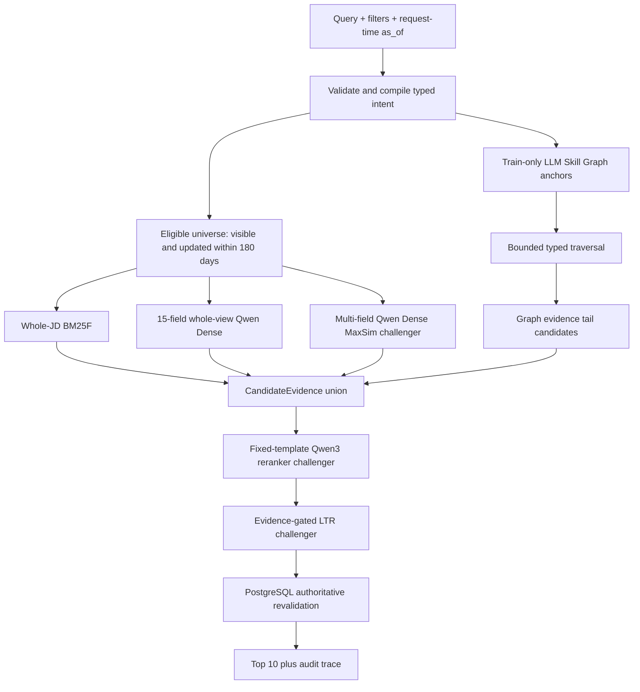

# 最終檢索架構與發布決策

本文件區分三件事：完整可擴充架構、目前有證據可發布的排序策略，以及已實作但尚未通過 promotion 的
challenger。模組存在不等於有權改排 Top 10；所有宣稱都以固定 339 個 context、固定 qrels、固定候選與
SHA-pinned artifact 為準，不使用人工補標或 test-period JD 建圖。

## 最終決策

- **可發布 incumbent**：dynamic `as_of` + 180 天 eligible universe + typed hard filters + whole-JD
  BM25F + PostgreSQL authoritative revalidation。Temporal-v3 在固定 339-context 開發評估中小幅但全面非退步。
- **Dense**：whole-view Qwen exact scorer、immutable 1.2M-vector cache，以及 occupation／skill／requirement／
  content 四類 multi-field archive 均保留；目前只允許 protected-tail／shadow。它可提高深度檢索 recall，
  但單獨取代 BM25 會降低 Top-10 指標。現行 whole artifact 是 15-field v1，不冒充尚未建完的 34-field v2。
- **Skill Graph**：train-only LLM ontology、job entity links、bounded typed traversal 與 trace 均保留。現有 Graph
  實驗沒有救回 zero-result query，另一個 ontology broadcast 會降低 Top-10，因此不得藉由架構偏好強行加權。
- **Qwen3 reranker v7**：獨立 endpoint 已部署，固定 job-search template 且 request 只能傳
  `model/query/documents`。Top-20、BM25 Top-1 保護、4:1 weighted-RRF 與 reranker rank weight 0.25 的
  diagnostic 為正，但第三條 rail 的信賴區間跨 0，Top-50 平均延遲 4.65 秒，因此正式排序維持 disabled。
- **LTR／behavior**：保留接口與 IPS／Doubly-Robust 訓練設計；目前沒有足夠可信的 chronological artifact，
  不使用 query history 直接回傳答案，也不讓歷史訊號新增候選。

## 線上請求流程



每條 candidate lane 使用同一個 eligible universe，不能先取 Top-K 再補做 hard filter。任一啟用模組缺少
artifact、lineage、容量或 endpoint identity 時整個宣告的 ranking profile fail closed；BM25-only 是一個
明確、已核准的 profile，不是隱藏 fallback。

## 各模組的工程與商業作用

### Query compiler 與 hard filters

- `as_of` 在 production 每次請求動態取得；競賽 Demo 固定為台灣時間 2026-06-08。
- eligible lower bound 是 `as_of - 180 days`。snapshot 中看似晚於 Demo 的更新時間保留，但 freshness 為 0
  並留下 audit flag，避免把已存在的資料武斷刪除。
- location 內 OR、duty 內 OR、兩群之間 AND；另支援明確學歷、月薪、工作性質、班別、無經驗與管理人數。
- 否定詞會局部阻止錯誤 hard filter，例如「不要兼職」、「不找晚班」、「管理人數不拘」。不確定意圖保留為
  lexical evidence，不猜測成結構條件。
- 若上述由 query 文字解析出的 typed constraints 使 lexical lane 完全為零，系統只重試一次並移除這組可能
  誤判的 typed constraints；原始 query、API location／duty、可見性、`as_of` 與 180 天範圍全部不變，trace
  標記為 `relaxed_query_text_constraints_after_zero`。這不是放寬使用者明確傳入的篩選條件。
- Tantivy pre-filter 後仍由 PostgreSQL 逐筆重驗，因為真實職缺的可見性、更新時間與招募狀態會變動。

### Whole-JD BM25F

職務名稱、職務分類、技能、產業與完整職務內容全部可被文字檢索；權重分別強調 title／duty／skills，body
權重較低但不會消失。這可處理精確職稱、地區／職類條件與罕見 OOV 字詞，也是目前最穩定的 Top-10 基礎。

### Whole-view 與 multi-field Dense

目前可重現的職缺 embedding 使用固定 15-field serializer，包含職稱、分類、技能、證照、學歷、經驗、城市、
產業、附加條件與職務內容。來源是 immutable Qwen3-Embedding-8B 4096d cache；serving projection 取 MRL
1024d、float32 L2 normalize 後存 float16，query 使用相同 projection。Dense 對同義詞與 OOV 有價值，
但不可繞過 eligible-row mask。34-field full-JD v2 builder／serializer 已存在；在 1,218,635 筆向量完成、
上傳並通過 row-order／hash gate 前，runtime 不得把舊 cache 改名成 v2。

現行 TEI endpoint 的 `MAX_INPUT_LENGTH=512`；10,000 筆 JD token audit 中約 11.94% 超過 512，長 JD 的內容尾部
可能被截斷。multi-field archive 因此把每筆 job 拆成 `occupation`、`skill`、`requirement`、`content` 四類，
content 以 256–384 token lossless chunks 建立 embedding，推論採 field-aware MaxSim。local archive 已完成
4,157,210 views／416 shards／8.8 GB；在 filter-aware MaxSim adapter 與 latency gate 完成前只可標為
artifact complete，不可宣稱 production ranking-active。

目前合理用法是保護 BM25 Top 10，再用 RRF60 把 Dense novel candidates 放入較深結果。這能提高 Top-100／
Top-1000 recall，又不犧牲當前 Top-10；待 ANN 通過 recall、latency 與 filter parity 才取代 exact scan。

### LLM Skill Graph

Graph 由六個 immutable JSONL table 組成：`jobs` Job nodes、`skills` canonical Skill nodes、
`job-skills` Job→Skill evidence edges、`duty-skills` Duty→Skill aggregate edges、`skill-relations` typed
Skill→Skill edges，以及 `relation-evidence` 對應的 train-JD evidence。edge 帶來源、支持度、train cutoff 與
evidence count；relation weight 是 `support / sqrt(source_support * target_support)`，Duty→Skill weight 是該
duty 的 train jobs 中包含技能的比例。建圖只使用 train cutoff 前的 JD，LLM 負責技能萃取、同義詞正規化、
分類與 typed relation 判斷。

推論先找 query 的 boundary-aware entity anchors，再做 bounded 1-hop traversal。Graph 候選只有在 lexical
或 Dense 對相同 job／concept 提供第二份證據時才能進 CandidateEvidence；單一弱 edge 只留 trace。這個設計
保留企業技能探索、相鄰職務與大結果集擴張能力，同時避免 Graph 在 Top 10 放大語意雜訊。

實際封存 trace 範例：`ctx:290723` 的 query「會計」先匹配 canonical alias `accounting`，保護原 BM25 Top 10
後，Graph lane 從相同 eligible Tantivy universe 找到 novel job `132214655`（graph rank 1，原始 graph
score `185.5253`）並放入候選池第 11 位等待內容模型確認。該 trace 同時記錄原始 query、canonical rewrite、
candidate origin、BM25／Graph rank 與完整候選集合；最終 ablation 無增益，因此此 job path 沒有取得
production Top-10 promotion 權限。

### Qwen3 reranker v7

vLLM 0.20.2 的 `RerankRequest` 沒有可變 `instruction` 契約，因此 v7 把 job-specific policy 固定在 chat
template：職稱／職類與明確條件優先；相關但不同職業不能只因共享技能互相替代；body 只能當支持證據。
request builder 只接受 `model/query/documents`。

部署 lineage：

- endpoint `work-retrieval-qwen3-reranker-8b-v7`
- endpoint config `work-retrieval-qwen3-reranker-8b-v7-g5-4xl`
- model `Qwen/Qwen3-Reranker-8B` revision
  `77d193c791ed757ca307ee72715aa132723da912`
- image digest `sha256:18998be4e1276d4eb6e98afe80798aa357c1cc37545150de5c210bc9111beb1d`
- chat-template SHA-256 `c917bf98a8ccffff1823e26060fa2c6f048b9a99b39f02771cfd4321f2cf7714`

固定 English 3-document smoke 是 454 prompt tokens。額外送入 4,600 字 top-level `instruction` 後，兩份
request 的 prompt tokens 均為 297、排序相同，最大 score jitter 為 0.000446，低於預先設定的 0.001 容忍值；
因此 request instruction 被證明不是可變 prompt contract。

## 固定評估結果

以下都是同一份 339-context development qrels；不宣稱是主辦方 hold-out 正式分數。

| Variant                   |  NDCG@10 |     P@10 |    Top-1 |      MRR | 決策                                       |
| ------------------------- | -------: | -------: | -------: | -------: | ------------------------------------------ |
| Temporal-v2 BM25 baseline | 0.105671 | 0.085170 | 0.133902 | 0.187320 | 對照                                       |
| Typed temporal-v3         | 0.105971 | 0.085718 | 0.133902 | 0.187374 | 可發布 incumbent                           |
| Whole Dense only          | 0.076027 | 0.066225 | 0.091859 | 0.154249 | 不可取代 BM25                              |
| Graph-conditioned cascade | 0.105671 | 0.085170 | 0.133902 | 0.187320 | 無增益，保持 gated                         |
| v6 reranker Top-10        | 0.099904 | 0.085170 | 0.112626 | 0.178590 | request prompt contract 無效，不 promotion |
| v7 fixed-template Top-10  | 0.099371 | 0.085170 | 0.112244 | 0.177334 | 契約有效但四項未改善，不 promotion         |
| v7 Top-20 p1 rank fusion  | 0.112146 | 0.091107 | 0.131737 | 0.193870 | diagnostic 正向，延遲／holdout gate 未過   |

Dense protected RRF60 保持所有 Top-10 指標不變，Recall@100 從 `0.262792` 提高到 `0.268880`，
Recall@1000 從 `0.431478` 提高到 `0.462621`。Graph-conditioned cascade 的 42 個 baseline zero-result contexts
救回 0 個；LLM ontology broadcast 雖產生 3,217 個 novel candidates，但 reranked Top-10 NDCG delta 是
`-0.006059`。這些數字支持「保留擴張能力、目前不改 Top-10」而不是宣稱 Graph 已提升準確率。

v7 的候選集合、339 qid 順序、42 個 zero-result qids、full-JD template 與 baseline bytes 都固定；sealed
manifest SHA-256 是 `c8d8cb1a78c7f7a5ce10f9f51b53c0820e3b285a94b94508c595ba360ac2cef5`。相對 baseline 的
NDCG@10 delta `-0.006300`、P@10 delta `0`、Top-1 delta `-0.021659`、MRR delta `-0.009986`，因此不能因為
prompt 契約已修正就跳過 quality gate。

新 Top-50 sweep 只呼叫 endpoint 一次後離線比較 74 個 variant。勝出者為
`rank_fusion_d20_p1_w0.25`：相對 BM25 的 GT1 NDCG@10 `+0.002525`（95% CI
`[0.001642, 0.003431]`），P@10 `+0.002382`、Top-1 不變、MRR `+0.003767`；GT2 亦為正，GT3
NDCG@10 `+0.007036` 但 CI `[-0.000118, 0.015915]`。Top-50 endpoint latency mean/p50/p95/max 為
`4650/4333/7502/10620 ms`，所以不開 active。加入 score ≥ 0.9 且 BM25/Dense 同 job gate 後，GT1
NDCG@10 只剩 `+0.000776` 且 P@10 `-0.002217`，同樣不 promotion。完整 report SHA-256 分別為
`6ed64711ce88b2869337d0b9a343dd726384718a1c2a131319531c2726a3e2ce` 與
`e9f6196e2cfb6ad11e8e6984773a6bf7293888c620aeb8ed56256f217c726fc1`。

### Learning-to-Rank

沿用既有 chronological context-purged IPS LambdaRank：objective `lambdarank`、gain `[0,1,3]`，position
propensity 最低裁切 0.1，label 0 權重再乘 0.25，避免把未互動當真負例。feature contract 包含 lexical／Dense／
Graph reciprocal rank、source count、concept coverage、literal title/whole match、Graph path、freshness 與 future
snapshot；最終版再加入四類 multi-field MaxSim、typed-constraint match、欄位完整度、reranker score 與 time-safe
CTR。行為訊號不新增候選，也不直接 replay query history。

目前 purged train 僅 27 groups／338 pairs；既有 no-Graph LTR 的 NDCG@10 為 `0.020470`，with-Graph 為
`0.027741`，均低於其 `0.057719` validation baseline。因此方法、feature/IPS script、artifact hash 與 runtime
gate 保留，但正式 profile 不啟用該模型；資料量不足時硬開 LTR 不具工程合理性。

## 偏差、OOV 與洩漏控制

- Graph、同義詞與任何 LLM extraction 只讀 train-period JD；test JD、qrels、labels、targets、raw query log
  不得出現在 runtime artifact inventory。
- OOV 先由 BM25 raw lexical evidence 和 whole-JD Dense 處理；Graph alias 只提供帶 provenance 的候選擴張，
  不把未知詞硬映射成已知技能。
- `label=0` 不當成負樣本。未來 LTR 只接受 chronological/purged groups，曝光位置使用 IPS 或
  Doubly-Robust 校正，並把 propensity clipping、effective sample size 與 calibration 固定在 artifact。
- query history 只能在 current eligible、已被內容模型打分的候選內提供 time-safe tie-break；相同 normalized
  query 必須排除，且不得直接新增或回傳 job ID。

## 一鍵重現與發布

```bash
# 固定 v7 endpoint 與黑箱契約驗證
uv run python scripts/deploy_sagemaker_reranker.py --execute

# Temporal-v3 release evidence；會重算四個指標並驗證所有 bytes
uv run python scripts/verify_temporal_v3_promotion.py verify \
  --candidate-manifest artifacts/experiments/tantivy-bm25-temporal-v3/manifest.json \
  --candidate-build-manifest artifacts/experiments/tantivy-bm25-temporal-v3/build-manifest.json \
  --attestation artifacts/evaluations/temporal-v3-fixed-339/attestation.json \
  --approved-attestation-sha256 <externally-approved-sha256>

# 主辦方 ZIP 到 PostgreSQL、immutable artifacts 與 deployment workflow
scripts/bootstrap_competition_release.sh \
  inputs/competition.zip \
  artifacts/bootstrap-$(date +%Y%m%d-%H%M%S) \
  artifacts/evaluations/temporal-v3-fixed-339/attestation.json \
  <externally-approved-sha256> \
  DEPLOY \
  your-alert-email@example.com
```

正式發布前仍須分別證明 Git commit、CI、image digest、runtime manifest、CloudFormation／ECS rollout 與至少
兩個不同 live query 的排序結果；endpoint `InService` 本身不是 ranking promotion 證據。
